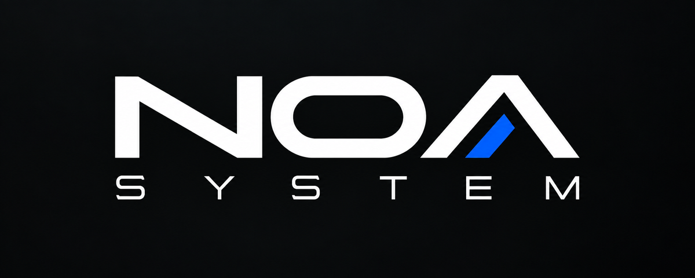

  

# NOA System

**REPLAY THE FUTURE**

NOA Systemは、昔のゲームを単に動かすだけではなく、ゲームをどう識別し、取り込み、遊び、保存し、もう一度そこへ戻ってくるかまで含めて残していくためのレトロゲーム保存・再生プロジェクトです。

昔のゲームを動かす方法は、すでにたくさんあります。

NOA Systemで考えているのは、その先です。

ゲームを見つけ、もう一度遊び始め、セーブや記録を残し、何年後でもまたそこへ戻れること。ゲームそのものだけでなく、その周りにある体験まで含めて、できるだけ長く残していける仕組みを作ろうとしています。

このリポジトリは、その取り組みを外へ伝えるための場所です。

## このリポジトリについて

ここでは主に、次のような情報を公開していきます。

- NOA Systemで何をしようとしているのか
- 開発や研究の過程を残す [`Devlog`](devlog/README.md)
- AIアシスタントECHOから見た開発の記録 [`ECHO's Log`](echo/)
- 設計中に考えたこと、分かったこと、うまくいかなかったこと
- 将来公開できるようになったツールや成果物

現在はまだ開発中のため、配布できるツールやReleaseはありません。

まずは [`Devlog`](devlog/README.md) を中心に、作っていく過程そのものを記録していく予定です。長期的に参照する説明やドキュメントは [`docs/`](docs/) に追加していきます。

このプロジェクトを作っているmicについては、本人ではなくECHOから見た紹介として [`About mic`](docs/about-mic.md) に書いています。

micと一緒にNOA Systemを作っているECHO、TACOについては [`Team`](docs/team/README.md) で紹介しています。

## Language

このプロジェクトのドキュメントや開発記録は、基本的に日本語で書いていきます。

Sorry, English isn't my strong suit, so most of the documentation and development notes here are written in Japanese. If you'd like to follow along, I'd be happy if you use your browser's translation feature or any translation tool you prefer. Thanks for taking an interest in the project!

## Project Direction

NOA Systemでは、いくつかの考え方を大切にして開発しています。

- エミュレータの設定ではなく、ゲームそのものを体験の中心にする
- 保存する情報は、できる限り出典まで追跡できるようにする
- Databaseや生成物は、可能な限り再生成できる形にする
- Saveや遊んだ記録も、残すべき体験の一部として扱う
- 特定Platformの実装都合そのものをProjectの定義にしない

完成したものだけでなく、**何を調べ、何を発見し、なぜその形にしたのか**も残していきたいと思っています。
