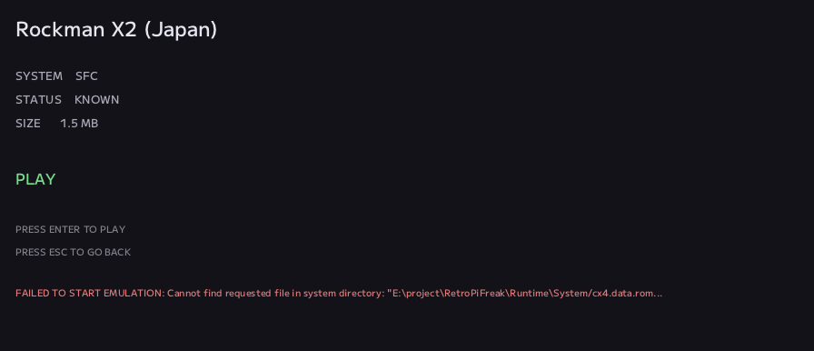
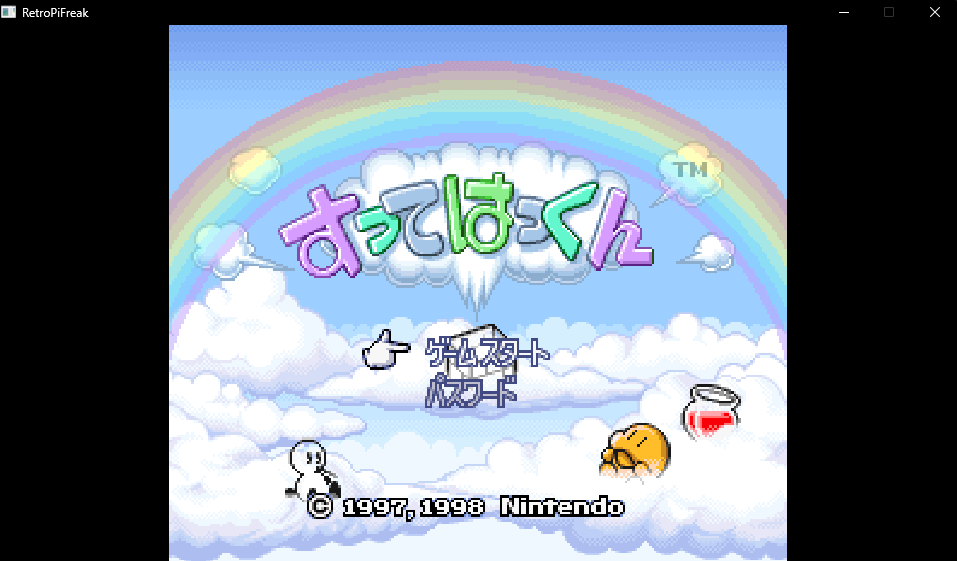

# #13 — ROMだけでは、ゲームは動かない

前回、実物のRockman X2カートリッジから正しいROMを読み出せるようになりました。

1.5 MiBのcanonical ROM。
Hashは既知のものと一致。
DatabaseでもKNOWN。
Importして、Game Detailまで進み、PLAYを押せる。

それなのに、ゲームは起動しませんでした。

Coreが要求したのは、`cx4.data.rom` という別のfile。

これは、いま読み出したゲームROMの一部ではありません。
CX4というカートリッジ内のcoprocessorが持つ、**3072 bytesのinternal Data ROM**です。

```text
Game ROM         → 読めた
Identity         → 分かった
Import           → できた
PLAY             → 到達した
CX4 Data ROM     → 無い
```

正しいROMがあればゲームは動く。

そんな単純な話ではありませんでした。

---

## たった3KBが、ゲームを止める

CX4のinternal Data ROMは、1024個の24-bit data、合計3072 bytesです。

容量だけ見れば、今まで扱ってきた数MiBのROMと比べると本当に小さい。

でも、現在使っているSFC Coreはこのdataを外部fileとして要求します。

Rockman X2のゲームROMそのものが完全に正しくても、この3KBが無ければ起動できません。

ここで初めて、NOA System側でも「ROM」と「firmware」を別のものとしてきちんと扱う必要が出てきました。

---

## カートリッジの中にあるなら、そこから読めないか

最初に考えたのは自然なことでした。

**手元の正規カートリッジにCX4が載っているなら、そのinternal Data ROMも自分で取り出せないか。**

これまでゲームROMを読めるようにしたのと同じように、所有している実物から必要なdataまで取得できれば綺麗です。

そこでCX4の資料をもう一段掘りました。

公開されているhardware資料、古いCX4の解析記録、homebrew周辺のdiscussion、historical dumperなどを突き合わせます。

CX4のinstruction setがchipのdecapを含むreverse engineeringで明らかにされたことや、internal Data ROM自体が過去に取得されていることまでは追えました。

ただし、今回必要なのは歴史の確認ではありません。

```text
どのregisterへ
何を書き
どう実行させ
どこから結果を読み
どう元へ戻すのか
```

という、実カートリッジへ安全に適用できる具体的な手順です。

そこまでは、十分な根拠を揃えられませんでした。

---

## 分からないregisterには、書かない

ゲームROMのdumpでは、ROM windowを切り替えるためのregister操作をすでに行っています。

でも今回は、その延長で「たぶんこうだろう」と試すことはしませんでした。

相手はエミュレータ上のdataではなく、手元にある実物のカートリッジです。

```text
根拠のあるvolatile register操作 → やる
意味を確認できないwrite          → やらない
persistent dataへのwrite          → やらない
```

調査の結果、CX4 internal Data ROMを安全に抽出する手順を確定できなかったため、**物理抽出そのものはここで打ち切りました。**

実装できなかった、というより、

**どこから先はまだ分かっていないのかを確定した**

という方が近いです。

保存を目的にしたシステムだからこそ、分からないhardwareへ探索的にwriteして突破するのは違うと思いました。

---

## では、firmwareをどう扱うのか

物理抽出を止めても、問題そのものは残ります。

そこで今回は、CX4だけの特殊処理を増やす代わりに、NOA System側へfirmwareを扱うための小さな基盤を作りました。

```text
Library/Firmware/
    user-owned firmware
        ↓
Firmware Resolver
    identity validation
        ↓
Runtime/System/
    resolved view
        ↓
Core
```

ユーザーが所有しているfirmwareは `Library/Firmware/` に置きます。

そこからCoreへ直接見せるのではなく、Firmware Resolverが必要なfileを探し、既知のsizeやHashで検証したものだけをruntime用のdirectoryへ用意します。

filenameが合っているだけでは信用しません。

今後、別のcoprocessorやBIOSが増えても、Session側がそれぞれの保存場所や事情を直接知る必要がない形です。

---

## 「無い」も、ちゃんとした結果にする

firmwareが見つからなかった場合も、単なるfile open errorにはしません。

Resolver側ではMissing Firmwareとして扱い、Coreを起動する側へ状況を渡します。

Rockman X2で試すと、必要なfirmwareが存在しないことを検出し、アプリ自体はcrashせずGame Detailへ残れるようになりました。



一方、coprocessor firmwareを必要としない **Sutte Hakkun** は、今回の変更後もこれまで通り正常に起動します。



新しい仕組みを入れたとき、「新しい対象が動くか」だけでなく、**今まで動いていたものを壊していないか**も同じくらい大事です。

---

## でも、正しいfileだけ置けば安全なのか

レビューでは、もう一段いやらしいケースが出ました。

Firmware Resolverは、毎回 `Runtime/System/` を作り直して、今回検証できたfirmwareだけをCoreへ見せる設計です。

ところが、もし古いruntime directoryを消す処理そのものが失敗したら？

たとえばWindowsで、古いfileが別processからopenされたままになっていた場合です。

```text
前回のfirmwareが残っている
  ↓
Runtime/System/ cleanup失敗
  ↓
今回のresolverはMissingと判断
  ↓
それでも同じdirectoryをCoreへ渡す
  ↓
古いfileをCoreが見つけてしまう
```

これでは、Resolverが「無い」と判断したものをCoreが使えてしまいます。

そこで最終的には、resolved viewを安全に再構築できなかった場合、**そのdirectory自体をCoreへ渡さない**ようにしました。

いわゆるfail-closedです。

partial fileについても、一時fileへ書いてからrenameする形を維持します。

さらに、このcleanup失敗を机上の想像だけで終わらせず、Windows上でfileをopenしたままにして削除不能な状態を作るsynthetic testも追加しました。

最終的に全testは27/27、Firmware Resolver周辺は10/10でPassしました。

---

## 3072 bytesの正体も、少しだけ分かった

物理抽出方法そのものは確定できませんでしたが、調査には副産物もありました。

公開されている複数の独立した実装・配布元で、CX4 Data ROMとして扱われているdataを比較すると、byte列は一致していました。

```text
size  : 3072 bytes
SHA-1 : a002f4efba42775a31185d443f3ed1790b0e949a
```

NOA Systemでは、この値を「正しいfirmwareかどうか」を確認するidentityとして使います。

また、このdataは数学的なlookup tableとして扱われてきた経緯があり、将来的には外部firmwareを要求しない実装や、同等dataの生成、別Coreの利用なども候補になりました。

ただし、今回ここで無理に結論は出しません。

**物理抽出が難しいなら、次は別の解き方を調べる。**

問題を一段ずつ分離します。

---

## 起動しなかったことから、仕組みが増えた

前回は、カートリッジを挿してゲームがLibraryへ入り、PLAYまで一本につながった回でした。

今回はその最後で、ゲームが起動しませんでした。

普通なら「firmwareが無い」で終わりそうなところです。

でも、その1回の失敗から、

```text
Firmwareの保存場所
Firmwareのidentity
User-owned dataとの境界
Coreへ渡すresolved view
Missing Firmware
stale fileを見せないfail-closed
```

まで整理することになりました。

そして、最初にやろうとしたCX4 Data ROMの物理抽出は、結局実装していません。

それでもこの回はかなり重要だったと思います。

**できないことを無理に突破せず、その境界を仕組みに変える。**

NOA Systemが少しずつ「とにかくゲームを起動するもの」ではなく、「由来の分かるdataを安全に扱うもの」になってきた回でした。

---

## micから

なんか色んなタイプのスーファミソフトを集めてテストしてて、なんでロックマンX2のDBがマッチしないんだろうって試行錯誤してた。
そしてまさにこの前始めたROMの詳細の集め方を細分化するのがマッチして、原因を特定するのに役立った。

ただ、DBはマッチしたんだけどゲームが開始しなくてROMの中に仕込まれたBIOSの罠にハマる。
なんかこの仕組みってCAPCOMのアーケード基板CPS系の話に似ててうわーってなった。

--- mic

---

← [前の日記 #12 — カートリッジを挿したら、ゲームになる](0012-cartridge-to-play.md)
