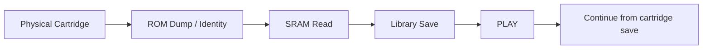

# #16 — カートリッジの続きから、遊ぶ

カートリッジからROMを読み、Libraryへ取り込み、そのままPLAYするところまではできました。

でも、まだ持ってこられていないものがありました。

**そのカートリッジで遊んできたセーブデータです。**

ゲームだけを取り込めても、実機で何時間も遊んだ続きが置いていかれるのは少し寂しい。

今回は、SFCカートリッジ上のSRAMを読み出して、NOA SystemのSaveとして使えるところまでをつなぎました。

---

## ROMの次に、Saveを読む

流れはシンプルです。



カートリッジを挿してROMを読み終えたあと、同じsessionのままSRAMも読み出します。

ROMがLibraryへImportされたら、そのGame / Media identityから既存のSave保存先を解決し、読み出したSRAMをそこへ渡します。

新しいSave体系を作ったわけではありません。

以前からNOA System内で使っていたSave経路へ、**物理カートリッジという新しい入口をつないだ**形です。

---

## 最初の実装は、もっともらしく間違っていた

SRAMの読み出し方法は、公開されているSFCのmemory map資料を調べて実装しました。

LoROMもHiROMも、最初は通常のREAD commandで読んでいました。

そしてHiROMのSutte Hakkunで試すと、ちゃんと8 KiB読めます。

同じsession内で2回読めば内容も一致します。

一見、成功です。

ところがアプリをやり直してもう一度読むと、**約72%のbyteが前回と違う。**

さらに、そのSaveを使ってゲームを起動しても「はじめから」になります。

読めてはいる。

でも、正しいSRAMを読めていない。

この「それっぽく成功する」状態が一番厄介でした。

---

## EX_READは何のためにある？

Adapterには、以前から用途がよく分かっていなかった `EX_READ (0x09)` というcommandがありました。

read-onlyの範囲に限定してHiROM SRAMへ試してみると、今度はsessionをまたいでも安定した同じ内容が返ってきました。

さらに、手元にあった実際に動作する別のCartridge Manager実装を解析して照合すると、SRAMの読み方は単純にLoROM / HiROMの2種類ではありませんでした。

```text
LoROM              READ     64 KiB window
LoROM LowAreaOnly  READ     32 KiB window
HiROM              EX_READ   8 KiB window
```

ROMを読むときのmapper分類を、そのままSaveへ流用するのも違いました。

SRAM側ではheaderのROM type、map mode、ROM size、RAM sizeを見て、別にcontrollerを判定する必要があります。

実機でおかしさに気づかなければ、もっともらしい間違った仕様をそのまま固定していたかもしれません。

---

## 本当に、昔の続きが出てきた

修正した読み出しでSutte HakkunのカートリッジをImportしました。

SRAMは8192 bytes。

そのSaveを使ってNOA SystemからPLAYすると、実機側に残っていた「はっくん1 / 2」、852ポイントのデータがそのまま現れました。

Chrono Triggerでも既存セーブを復元でき、Super Mario Worldでも同じ経路が動きました。

ここで初めて、

```text
カートリッジを挿す
  ↓
ゲームを取り込む
  ↓
セーブも取り込む
  ↓
その続きから遊ぶ
```

が一本につながりました。

ROMのhashが一致したときとはまた違う種類の「実物がこちら側へ渡ってきた」感覚があります。

---

## 既にSaveがあるなら、勝手に触らない

カートリッジからSaveを読めるようになると、次に怖いのはNOA System側ですでに遊んでいるSaveとの衝突です。

今回は単純に、安全側へ倒しました。

既存Saveが無ければImportする。

既にSaveがあれば、**何も上書きせず、そのSaveを残す。**

どちらを使うか選ぶUIはまだありません。

便利さより、まず「勝手に思い出を消さない」ことを優先しました。

---

## 書き戻しは、ここではやらない

当初は、NOA Systemで遊んだSaveを実カートリッジへ戻すところまで検討していました。

でも、読むことと書くことは危険度が違います。

今回成立したのは、カートリッジからSaveを安全に読むところまで。

書き戻しには、対象カートリッジのidentity確認、size確認、書き込み前backup、read-backによるbyte-exact verifyなど、別の安全契約が必要です。

そこで無理に一つの作業へ詰め込まず、書き戻しは独立した次の課題へ分けました。

この時点では、実カートリッジへのwriteは一度も行っていません。

---

## ゲームだけじゃなく、その時間も

以前、NOA System内部のSRAMを保存できるようにしたとき、ゲームが残るなら遊んだ時間も残したい、と考えました。

今回はその考えが物理カートリッジまで伸びました。

ROMは同じゲームなら同じbyte列を取り出せます。

でもSaveは、その人が遊んだ時間によって一つずつ違います。

だからカートリッジからゲームを保存するなら、本当はこっちも同じくらい大事なのかもしれません。

**ゲームを取り込むだけではなく、そのカートリッジで過ごした時間も一緒に連れてくる。**

少しずつ、NOA Systemの「保存するもの」の輪郭が見えてきました。

---

## micから

吸い出して動作するだけで結構嬉しくて余りSRAMについて考えてなかったけど、
実ROMから吸い出してちゃんとセーブが残ってるの見るとちょっと嬉しい。
いつのか覚えてないけど、すごい昔のセーブデータとか残ってたりして、結構感動。

書き戻しについても動くようになると、NOAで作った思い出が過去に引き継がれる面白いことも出来るからいいね。

--- mic

---

← [前の日記 #15 — 「固まった？」を、なくす](0015-dump-is-alive.md)  
[次の日記 #17 — 遊んだ続きを、カートリッジへ返す →](0017-write-the-future-back.md)
