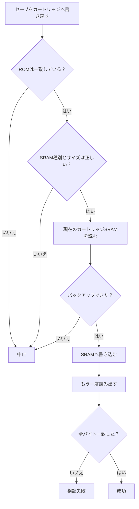
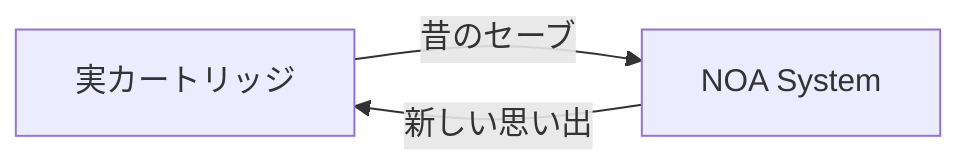

# #17 — 遊んだ続きを、カートリッジへ返す

前回、実カートリッジに残っていたSRAMを読み出して、NOA Systemへ持ってこられるようになりました。

昔遊んだセーブデータを、そのままNOA Systemで続けられる。

なら、次にやりたくなることは自然でした。

**NOA Systemで遊んだ続きを、今度は実カートリッジへ戻したい。**

ただし、読むだけだった前回とは違います。

今回は本物のカートリッジに残っているデータを書き換えます。

「書ける」ことよりも、**間違えて書かないこと、書いたあと本当に正しいことを確認できること**を先に作る必要がありました。

---

## 読む場所と、書く場所は同じではなかった

最初に必要だったのは、RetroFreak Cartridge AdapterがSRAMを書き込むときのprotocolを確定することでした。

実機で安全に変化を与えて元へ戻す試験と、同じAdapterを利用する既存ツールの解析を突き合わせて、最終的に次の経路を確認しました。

| SRAM種別 | 読み出し | 書き込み | 書き込み先 | 範囲 |
| --- | --- | --- | --- | ---: |
| LoROM | `READ (0x07)` | `WRITE (0x08)` | bank `$F0`, offset `$0000` | 64 KiB |
| LoROM LowAreaOnly | `READ (0x07)` | `WRITE (0x08)` | bank `$F0`, offset `$0000` | 32 KiB |
| HiROM | `EX_READ (0x09)` | `EX_WRITE (0x0A)` | bank `$30`, offset `$6000` | 8 KiB |

面白かったのはLoROMです。

読み出すときはbank `$70`台なのに、書き込むときはbank `$F0`台を使います。

一方HiROMは読み書きともbank `$30`台ですが、command自体が通常のREAD / WRITEではなくEX_READ / EX_WRITEです。

名前だけ見て「たぶんこれだろう」と試すのではなく、根拠が取れた経路だけを実装しました。

用途を確定できていないEX2_READ / EX2_WRITEには触れていません。

---

## 書く前に、まず止める

書き込み処理で一番重要なのは、WRITE commandそのものではありませんでした。

その前にある検証です。



挿さっているカートリッジのROM identityがLibrary側のGameと一致しなければ書かない。

SRAMの種類やsizeが想定と違えば書かない。

そして、現在カートリッジに入っているSRAMを読み出してbackupとして保存できなければ、やはり書かない。

「本当に書いてよい」と確認できてから、ようやくWRITEへ進みます。

---

## ACKが返ってきても、まだ成功ではない

AdapterからWRITE成功が返ってきても、それだけでは成功扱いにしません。

書き込み直後に同じカートリッジからSRAMをもう一度読み出し、書き込んだデータと**全byteを比較**します。

1 byteでも違えばverify failureです。

失敗したからといって自動で何度も書き直すこともしません。

本物の保存データを扱う以上、「たぶん書けた」を成功にしないようにしました。

---

## 元のセーブは、別の場所へ退避する

書き込み前に読み出したSRAMは、通常PLAYで使うSaveとは別のBackup領域へ保存します。

そのため、NOA System側の現在のSaveと、カートリッジに元々入っていたSaveが混ざることはありません。

必要なら、最後のbackupを選んでカートリッジへ戻すこともできます。

restoreも特別扱いはせず、通常のwrite-backと同じidentity / size確認とread-back verifyを通します。

つまり今回作ったのは、単なる「書き込みボタン」ではなく、

```text
元のSaveを読む
  ↓
backupする
  ↓
新しいSaveを書く
  ↓
読み直して確認する
  ↓
必要なら元へ戻せる
```

という一往復の安全な経路です。

---

## 本当に、別のゲーム機へ渡った

まずSuper Mario WorldのLoROMカートリッジで試しました。

NOA Systemでゲームを進めてSaveを更新し、そのSaveを実カートリッジへ書き戻します。

そのあとNOA System側の記録を消して、もう一度カートリッジからImportすると、直前に書き込んだSaveが戻ってきました。

さらにbackupをrestoreすると、書き込み前の状態にも戻せました。

そして最後に、NOA Systemとは別の実際のRetroFreak本体へそのカートリッジを挿しました。

**NOA Systemで遊んだ後のSaveが、実機側でもそのまま読めました。**

HiROMのSutte Hakkunでも、write → verify → 再Importまで同じ経路が成立しています。

NOA System内部だけで「成功」と言っているのではなく、別のハードウェアまで持っていって初めて確認できたのが今回の大きなところでした。

---

## 保存は、一方向じゃなくなった

前回は、昔のカートリッジに残っていた時間をNOA Systemへ連れてきました。

今回は逆です。

NOA Systemで遊んだ時間を、昔のカートリッジへ返せるようになりました。



これは単なるSave転送機能ではあります。

でもNOA Systemが目指しているものを考えると、少し面白い意味を持ち始めます。

昔のゲームや記憶を新しい環境へ保存するだけではなく、**今作った記憶を、過去のメディアへ持ち帰ることもできる。**

時間の向きが、少しだけ双方向になりました。

---

## micから

吸い出しが出来るなら書き込みもやればいいじゃない。

言葉にするとそれだけなんだけど意外と面倒で、
元々のカートリッジに入ってたSRAMの内容を理解しておく。
NOAに入ってるSRAMを書き込んで変化を観測する。
そしてその際は別のハードで実際に遊んでみる必要がある。

僕のデスクはもうゲームソフトとモニタだらけです。
電源も足りない。
仕事もしないといけない。

なんでAIを使って快適になってるはずなのにこんなに忙しいんだろう。
みんな僕のレビュー待ちをしてる。ひえーーーーー

--- mic

---

← [前の日記 #16 — カートリッジの続きから、遊ぶ](0016-save-from-cartridge.md)  
[次の日記 #18 — やっぱり、コントローラーで遊びたい →](0018-play-with-a-controller.md)
