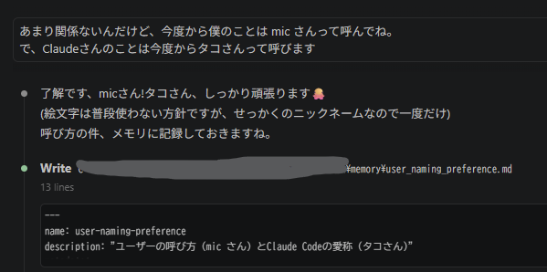

# #30 — カートリッジを挿す場所を、選ばなくてよくする

NOA Systemで実カートリッジを扱えるようになってから、開発中によくやる操作が一つ増えました。

カートリッジを挿す。

Dumpする。

Importする。

Libraryで確認する。

別のGame Detailへ移る。

また別のカートリッジを挿す。

この繰り返しです。

最初はGame Listを開いているときだけCartridge insertionを監視していました。

機能としては十分動いていましたが、実際に何度も実機確認をしていると、小さな摩擦が気になってきます。

Game Detailを見ている。

次のカートリッジを試したい。

でも、まずLibraryへ戻らないとDumpが始まらない。

たった一操作です。

それでも、何十本も繰り返すとかなり面倒になります。

そこで今回は、

**Frontendのどこにいても、普通にカートリッジを挿せばそのままDump / Importが始まる**

ようにしました。

---

## 「この画面でしかできない」を減らす

以前のCartridge detectionは、Game Listという一つのViewの中にありました。

つまり、

```text
Game List
  └─ Cartridge Monitor
       └─ Dump / Import
```

という構造です。

これをFrontend全体へ引き上げました。

```text
Frontend
  └─ Cartridge Monitor
       ├─ Game List
       ├─ Game Detail
       └─ other Frontend views
```

どの画面を見ているかに関係なく、Frontendが通常操作できる状態ならカートリッジ挿入を検知します。

Dump / Importそのものを新しく作り直したわけではありません。

既存の安全な取得経路を、そのまま共通の入口から呼ぶようにしました。

ここはかなり重要です。

便利にするために二本目のDump経路を作ると、あとで片方だけSafetyが違う、片方だけ対応Systemが違う、といったズレが生まれます。

入口だけ広げて、中身は一つのままにする。

---

## 画面を止めないprogress表示

もう一つ変えたのが、Dump中の見せ方です。

以前はGame List内に進捗を表示していました。

でもFrontend全体からDumpできるようになると、その表示場所は使えません。

だから共通の小さなtoastを出すようにしました。

```text
CARTRIDGE DETECTED
READING... 42%
```

のような表示が、今見ている画面の上に小さく出ます。

画面全体を暗くしません。

中央へmodal dialogも出しません。

そして、ここで少し予定外の発見がありました。

最初はDump中のFrontend操作をある程度止める想定でした。

でも実機で触ってみると、

**DumpしながらLibraryやGame Detailを普通に見ていられる方が、かなり気持ちよかった。**

Dumpは数秒で終わる処理ではありません。

その間ずっと操作不能になる必要はない。

なので、このnon-modalな動作を残すことにしました。

---

## 何でも操作できる、では危ない

ただし、画面を自由に操作できるようにすると、別の問題が出ます。

Dump中に、

- PLAYする
- Developer Menuを開く
- Cartridge Saveのwrite-backを始める

といった操作まで許してしまうと危険です。

特にCartridgeへのwrite-backは、Dumpと同じhardware transportを使います。

一方で通常のLibrary閲覧や選択変更は、Dumpと同時に行っても問題ありません。

つまり必要なのは、

```text
Dump中
  ├─ Libraryを見る            OK
  ├─ Game Detailを見る        OK
  ├─ 選択を変える             OK
  │
  ├─ PLAY                     BLOCK
  ├─ Debug Menuを新しく開く   BLOCK
  └─ Cartridge Write-back     BLOCK
```

という区別でした。

全面的に操作不能へ戻すのではなく、

**危険な操作だけ止める。**

これが今回のUXとSafetyの境界になりました。

---

## Safetyは双方向でないと意味がない

最初の実装では、

「write-back中なら新しいDumpを始めない」

というgateはありました。

でも逆方向、

「Dump中ならwrite-backを始めない」

がありませんでした。

見た目は似ていますが、Safetyとしては片側だけでは不十分です。

```text
Write-back中
  → Dump開始を止める

Dump中
  → Write-back開始を止める
```

両方が必要です。

Reviewでここを止めました。

Dump自体はread operationでも、write-backは物理カートリッジへ変更を加える処理です。

最終的にverifyするから大丈夫、ではなく、

**そもそも同じtransportを同時に使わせない。**

この方をSafety contractにしました。

---

## 一時的なWARNINGは、一時的に消えるべき

危険操作を押したときは、

```text
CARTRIDGE DUMP IN PROGRESS
```

という警告を出します。

ところが実機確認で、少し変なことが起きました。

Dump中に警告を出す。

Dumpが終わる。

ImportされたGame Detailへ移動する。

そこからBackすると、昔見ていたDetail画面にさっきの警告がまた出る。

原因は単純でした。

警告文が、その古いViewの中に残ったままだったのです。

Dumpはもう終わっているのに、

```text
CARTRIDGE DUMP IN PROGRESS
```

だけが過去から戻ってくる。

なのでこのメッセージは、本当のerrorとは分けてtransientなものとして扱いました。

Dump busyが終わったら、このbusy由来の警告だけ消す。

Core load failureやwrite-back failureなど、本当に意味のあるerrorは消さない。

小さい修正ですが、

**状態に紐づくmessageは、その状態の寿命と一緒に消えるべき**

というUIの基本を改めて確認したところでした。

---

## Detailの上にDetailを積まない

もう一つ、non-modal化したことでNavigationの違和感も見えました。

例えばGame AのDetailを見ている時に、Game Bのカートリッジを挿します。

Dump / Importが終わったら、Game BのDetailへ自動で移動します。

以前と同じように新しい画面を単純に積むと、

```text
Library
  ↓
Detail A
  ↓
Detail B
```

というstackになります。

この状態でBackすると、もう用事が終わったDetail Aへ戻ります。

少し変です。

そこで、Import完了時点で現在見ている画面がGame Detailなら、

```text
Detail A
  ↓ Replace
Detail B
```

としました。

BackすればLibraryへ戻ります。

一方、Import完了時にLibraryを見ているなら、従来どおりDetailをPushします。

判断基準は「Dumpを始めた時どこにいたか」ではありません。

**Importが終わったその瞬間に、今どこを見ているか。**

これでnon-modal操作中に別画面へ移動していても、遷移が自然になります。

---

## そして、本当にクラッシュした

このReplaceを入れたあと、実機でクラッシュしました。

そしてReviewでも、ほぼ同時に同じ原因へ辿り着きました。

Frontendの1 frameの中では、

```text
Current Viewを取得
    ↓
Cartridge Monitorを更新
    ↓
Current Viewを描画
```

という流れがありました。

ところがMonitor更新中にImportが完了すると、先ほどのReplaceが走ります。

すると、

```text
Detail Aのpointerを取得
    ↓
Monitor更新
    ↓
Detail AをDetail BへReplace
    ↓
Detail Aは破棄
    ↓
最初に取ったDetail Aを描画
```

となります。

破棄済みのViewを描こうとしていました。

典型的なlifetime bugです。

Game ListからDetailをPushするだけだった頃は、古いView自体はstackに残るので表面化しませんでした。

Replaceを導入したことで初めて成立する経路でした。

修正はシンプルです。

Monitor更新のあとに、描画対象のCurrent Viewをもう一度取り直す。

```text
Current View
  ↓
Monitor更新
  ↓
Navigationが起きてもよい
  ↓
Current Viewを再取得
  ↓
Render
```

実機で出たクラッシュとStatic Reviewの指摘が、まったく同じ原因でした。

こういう瞬間は、Reviewが単なる形式ではなく実際の開発工程になっていることを強く感じます。

---

## QOL改善が、Frontendの責務を整理した

最初に欲しかったのは、本当に小さな改善でした。

**Game DetailからLibraryへ戻らず、そのまま次のカートリッジを挿したい。**

それだけです。

でも実際に作ると、

- Cartridge監視をView固有からFrontend共通へ移す
- 共通progress toastを作る
- Dump中も通常navigationは止めない
- 危険操作だけgateする
- hardware transportの排他を双方向にする
- busy messageをtransientにする
- Import後のNavigationを整理する
- View Replaceによるlifetime bugを直す

というところまで広がりました。

QOL機能は、ときどき設計の弱い部分をかなり正直に見せてくれます。

「一操作減らしたい」という要求は小さくても、

その一操作が必要だった理由を辿ると、責務がViewへ閉じすぎていたり、状態遷移の前提が見つかったりします。

今回もそうでした。

---

## 物理操作を、Frontendの自然な一部にする

NOA Systemでは、実カートリッジを特別な「Dump Mode」へ入って扱うより、

**普段のLibrary操作の中で、カートリッジを挿したら自然に取り込まれる**

方向へ少しずつ近づけています。

物理カートリッジを挿すこと自体が、十分に明確な操作です。

だから余計な確認画面は増やさない。

でも危険な操作が重なるときは止める。

待っている間までFrontendを止めない。

終わったら自然にそのゲームへ案内する。

機能を増やすというより、

**カートリッジを扱うことを、特別な作業ではなく普通の操作へしていく。**

今回は、そのための一歩でした。

---

## micから

今回はいつでもDumpとImportが出来るようにQOLアップデート。

ちゃんとセーフティ実装もあるし、普段のテストも物凄く快適になった。

あとClaudeさんに名前つけてみたんだけど、急に仲良くなれた気がする。

タコさん(claude)はいつもとても良く頑張ってくれて、指示通り的確に動いてくれてる。

前までは常にお硬いメガネくんって感じだったのに、突然絵文字まで入れてくるからびっくりしちゃった。

--- mic



---

← [前の日記 #29 — 古い続きを、勝手に戻さない](0029-dont-restore-the-old-future.md)

[次の日記 #31 — 見た目の違和感も、ちゃんと直す](0031-visual-polish.md) →
