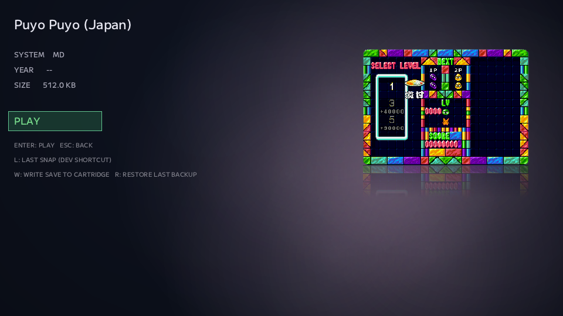

# #31 — 見た目の違和感も、ちゃんと直す

NOA SystemのGame Detailには、AutoSnap PreviewをMain Visualとして表示しています。

最後に遊んでいた場面が、Game Detailの右側に残る。

機能としてはもう動いていました。

でも、ずっと少しだけ気になっていたところがありました。

画像の見え方です。

Titleとの距離。

枠との関係。

Aspect Ratio。

そして、せっかくなら少しだけNOAらしい見た目にしたい。

今回は、大きな機能を追加した話ではありません。

**「動いているけど、なんとなく気になる」をちゃんと直した話**です。

---

## まず、本当にstretchしているのか確認する

最初に気になっていたのは、Main VisualのAspect Ratioでした。

固定サイズの領域へPreviewを表示しているので、

「画像が横や縦に伸びていないか」

を疑いました。

でもコードを追ってみると、Aspect Ratioを維持するcontain表示自体は既に入っていました。

```text
Image
  ↓
Aspect Ratioを維持
  ↓
Main Visual領域へcontain
```

つまり、問題は単純なstretchではありませんでした。

画像自体は正しく収まっている。

でも固定のboxや背景との関係が不自然だった。

pillarbox / letterboxで余白が出たときに、その余白と枠が「画像の外形」に見えてしまう。

**正しく描画されていることと、正しく見えることは別でした。**

---

## TitleとMain Visualを少し離す

もう一つ気になっていたのが、Titleとの距離です。

長いタイトルになると、Main Visualが上に居すぎて窮屈に見えます。

そこでMain Visualの上端をTitle基準ではなく、左側のSYSTEM行あたりまで下げました。

```text
TITLE........................................

SYSTEM   MD                    [ Main Visual ]
YEAR     --                    [             ]
SIZE     ...                   [             ]
```

Main Visual専用の数字を適当に足したわけではありません。

左側の情報blockと同じ基準位置を共有させました。

これなら将来layoutを動かしても、左右が別々にずれにくくなります。

小さな変更ですが、Game Detail全体の呼吸が少し楽になりました。

---

## せっかくなので、反射も試してみる

ここで一つ、必須ではない実験を入れました。

Main Visualの下に、薄い鏡面反射を置いてみる。

```text
[ Main Visual ]
[ reflection    ]
     ↓
徐々にfade out
```

これは最初から採用すると決めていたわけではありません。

見てみてNOAに合わなければ外す。

その程度のOptional polishです。

最初の実装では、反射領域を横方向のbandへ分け、下へ行くほどalphaを下げる方法を使いました。

処理は単純です。

そして実機で見てみると、

**反射そのものは、かなり良かった。**

でも別のところが気になりました。

枠です。

---

## 「反射はいい。ちょっと枠が惜しい」

実機での最初の感想は、かなり分かりやすいものでした。

反射はいい感じ。

でも、枠が少し惜しい。

画像はAspect Ratioを保ってcontainされています。

ところが枠は固定box全体を囲んでいる。

なので、

```text
固定box
+----------------------+
|   [ 実画像 ]         |
|                      |
+----------------------+
```

のように、実際の画像サイズと枠のサイズが一致していませんでした。

だったら、枠も実際に表示されている画像へ合わせればいい。

描画後の実サイズを正として、

```text
画像の表示領域 = 枠の表示領域
```

に変更しました。

letterbox / pillarbox部分を無理にカード背景として塗らず、背後のGame Detail背景をそのまま見せます。

これで「固定枠の中に小さな画像がある」感じではなく、

**画像そのものがMain Visualとして置かれている**

見え方に近づきました。

---

## 角丸は、画像も枠も一緒に

枠を画像サイズに合わせるなら、もう一つ気になります。

角です。

枠だけ丸い。

画像は四角い。

あるいは画像は丸いけど枠がsharp。

どちらも少し気になります。

なので、画像そのものを角丸でclipし、枠も同じ形にしました。

単色の角丸矩形は既に描けましたが、textureを角丸で描くには少し工夫が必要です。

画像を、

```text
中央
上下の帯
四隅
```

へ分け、四隅はquarter-circleとして描画します。

texture座標も同じ形に割り当てます。

結果として、元画像を別にcropしたり加工したりせず、contain後の画像をそのまま角丸で表示できるようになりました。

NO IMAGE側の枠も同じ角丸outlineへ揃えました。

---

## 反射の「短冊」も消す

実機で見ると、反射にももう一つ気になるところがありました。

最初の疑似gradientは複数のhorizontal bandを並べていたので、よく見ると境界が見えます。

薄い短冊が並んでいる感じです。

そこでband方式をやめ、頂点alphaの線形補間を使う方法へ変えました。

一枚のquadの上側を少し濃く。

下側を透明に。

GPU側でその間を補間してもらいます。

```text
alpha 高
████████
▓▓▓▓▓▓▓▓
▒▒▒▒▒▒▒▒
░░░░░░░░
透明
```

これで継ぎ目のないgradientになりました。

鏡像そのものも、別の画像を作るのではなくtexture座標を逆方向へ読むだけです。

見た目のための処理ですが、必要以上に複雑にはしていません。

---

## 見た目は、実際に見ないと分からない

今回のIssueで一番大きかったのは、コードではありません。

最初の実装は、仕様としてはかなり正しかったです。

- Aspect Ratioは維持されている
- Titleとは重ならない
- Preview無しでも壊れない
- 反射も仕様どおり入っている

でも実画面を見ると、

「反射はいい」

「枠が惜しい」

「この継ぎ目は見える」

ということが分かります。

こういう部分は、自動testだけではなかなか決まりません。

数字が正しいかではなく、

**見たときにどう感じるか**

だからです。

---

## AIへ見た目を伝える

見た目や手触りの話は、実装仕様より伝えるのが難しいことがあります。

「もう少し自然に」

「ここがなんとなく惜しい」

「こういう雰囲気にしたい」

人間同士でも齟齬が起きやすい表現です。

今回も、

```text
反射はいい
枠が惜しい
```

というかなり感覚的なfeedbackから修正が始まりました。

でも、その感覚を

```text
固定boxと実画像の外形が一致していない
角丸形状が画像と枠で一致していない
band gradientの境界が視認できる
```

という実装上の問題へ落としていけば、ちゃんと直せます。

この往復がかなりうまくいきました。

---

## 必須ではないものも、プロジェクトの一部

NOA Systemでは、まず動かすことを優先してきました。

ROMを読む。

Libraryへ入れる。

ゲームを起動する。

Saveを残す。

そこが成立していないうちに、見た目だけを磨いても仕方ありません。

でも、だからといって見た目をずっと後回しにする必要もありません。

実際に使っていて気になったなら直す。

大きなUI overhaulではなくても、

「ここの違和感だけ取りたい」

というIssueがあっていい。

Game Detailを見る回数は多いです。

そのたびに少し気になっていたものが、気にならなくなる。

そういう小さな修正も、使い続けるソフトには効いてきます。

最終的には、こんな見た目になりました。



<sub>※ 掲載している画面はNOA Systemの開発・動作紹介を目的としたものです。画面内に表示されるゲーム映像・タイトル等の著作権および関連する権利は、それぞれの権利者に帰属します。</sub>

---

## micから

必須じゃないけどずっと気になってた所を修正できた！

見た目の部分とか手触りの部分は人間相手でも中々伝わらないし齟齬が起きやすい部分なので、今回上手く伝えて修正できたのはとても嬉しい。

タコさんありがとう！( Echo もね )

--- mic

---

← [前の日記 #30 — カートリッジを挿す場所を、選ばなくてよくする](0030-cartridge-anywhere.md)

[次の日記 #32 — 三台目のハードが、NOAに加わった](0032-third-system-pce.md) →
