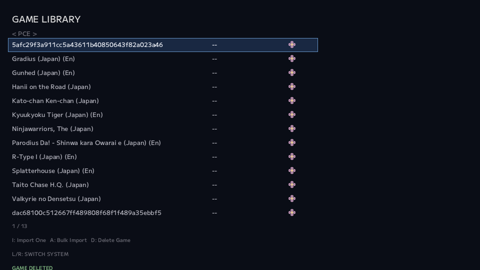
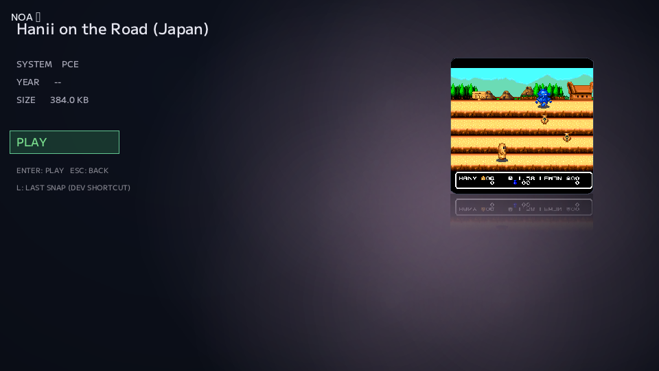

# #32 — 三台目のハードが、NOAに加わった

SFC。

Mega Drive。

そして次に増えたのが、PC Engineでした。

対応Systemが一つ増える。

言葉にするとそれだけですが、NOA Systemではそこに二つの意味があります。

一つは、実物のHuCardからROMを読めること。

もう一つは、そのROMをLibraryへ取り込み、実際にPLAYできること。

今回はこの二つがほぼ同じ日に一気につながりました。

さらに途中で、384 KiBという少し変わった物理配置のHuCardまで出てきます。

**三台目のSystemが増えた日**の話です。

---

## まずは、HuCardをそのまま読む

PCEの最初の目標は、standardなHuCardを安全に読むことでした。

ここでも最初から「それっぽく切ればよい」とはしません。

物理カートリッジからはまずraw bytesを読む。

region変換やcanonicalizationはその後。

```text
Physical HuCard
    ↓
Raw physical bytes
    ↓
Candidate generation
    ↓
Structural evidence
    ↓
Trusted exact hash
    ↓
Canonical ROM
```

この順番です。

PCEには、SFCのように強い共通HeaderだけでROM sizeを決められる仕組みがありません。

だからDevice側で勝手に意味を付けず、最大範囲をread-onlyで取り込みます。

そのうえで、

- as-read
- bit-reversed
- small / mirrored ROM candidate

をImport側で検証します。

物理readとcanonicalizationを分けることで、UnknownなHuCardへ推測で手を入れないようにしています。

---

## Prefixが一致するだけでは切らない

最初の実装Reviewで、一つ大事な問題が見つかりました。

小容量ROMのcandidateを探すために、

「先頭256 KiBがKnown ROMのhashと一致した」

だけで切り出してしまうと、後ろに意味のあるデータを持つUnknown cartまで誤ってtrimする可能性があります。

exact hashは強い証拠です。

でも、それだけでは足りません。

PCEでは、

```text
raw全体が、そのcandidate size周期のmirrorになっている
        +
candidateがtrusted DB exact hashと一致
```

の両方を要求するようにしました。

例えば256 KiBのROMが1 MiB空間へ4回mirrorされているなら、

```text
256 KiB
256 KiB
256 KiB
256 KiB
```

の4領域がbyte-exactに同じであることを確認してからcandidateへ昇格します。

hashが一致しただけでは採用しない。

ここでも、前にResearchで決めた

**「構造的に説明できるcandidateだけをtrusted hashで確定する」**

というルールが効きました。

---

## 実機テストを始めると、一気に忙しくなった

実装が通ったら、当然次は実HuCardです。

最初にKnownとして認識できたのは、

- かとちゃんケンちゃん
- R-TYPE I
- パロディウスだ！
- ワルキューレの伝説

などでした。

一方で、認識しないHuCardもかなりありました。

最初は、

「未対応mappingなのか？」

と思いたくなります。

でも実際に何度もDumpしてみると、そう単純ではありませんでした。

同じHuCardなのにdumpごとにhashが変わる。

接触状態によって結果が変わる。

逆に、DBには一致しないのにCoreでは正常に起動する。

つまり、

```text
DB miss
≠ Dump失敗
```

です。

そこで実機確認を、

```text
Dump再現性
DB exact match
Core起動
```

の三軸で記録するようにしました。

これで、

```text
毎回dumpが変わる
→ canonicalizationより前にread stabilityを見る

dumpは毎回同じ / DB miss / Core起動
→ physical readはかなり正しそう
→ canonical layoutの違いを調べる
```

と切り分けられます。

対応ハードが増えるほど、人間側の確認項目も一気に増えます。

この頃から、実機Acceptance自体を「覚えておく作業」ではなく、明示的な記録として管理する意味が大きくなってきました。

---

## そしてPCEが実際に起動した

HuCardからKnown ROMが取れたら、次はRuntimeです。

ここは意外なくらい静かでした。

PCE用に選んだCoreを配置すると、既に共通化されていたSession経路でそのまま起動できました。

```text
Library
  ↓
Game Detail
  ↓
PLAY
  ↓
Common Session
  ↓
PCE Core
```

SFC。

Mega Drive。

PCE。

Systemが三つになっても、PLAY経路そのものをPCE専用に作り直す必要はありませんでした。

これは、Mega Driveを二台目として追加した時に共通化した設計が、そのまま三台目でも使えたということです。

実機Acceptanceでは、

- Game Detail → PLAY
- 映像
- 音声
- controller入力
- EXITでFrontendへ戻る
- Screenshot / Capture

まで確認しました。



<sub>※ 掲載している画面はNOA Systemの開発・動作紹介を目的としたものです。画面内に表示されるゲーム映像・タイトル等の著作権および関連する権利は、それぞれの権利者に帰属します。</sub>

新しいSystemが増えた時に、「また全部専用実装」が必要にならなかった。

ここは、二台目で試した設計が本当に横へ広がっていることを感じたところでした。

---

## でも、384 KiBは素直ではなかった

standard HuCardの確認を進めていると、何本か妙なものが残りました。

- はにいおんざろおど
- タイトーチェイスH.Q.
- ガンヘッド
- ニンジャウォーリアーズ

これらは物理read自体は安定しています。

Coreでも起動します。

でも、1 MiB rawのままではtrusted DBへ一致しません。

調べてみると、4本とも同じ特徴がありました。

canonical ROMは384 KiB。

でも物理address上では、

```text
0x000000 - 0x03FFFF   256 KiB
0x080000 - 0x09FFFF   128 KiB
```

の二つをつなぐ必要があります。

つまり、

```text
raw先頭384 KiBを切る
```

ではありません。

```text
raw[0x00000:0x40000]
        +
raw[0x80000:0xA0000]
```

という、physical layoutを理解した再構成です。

---

## 仮説だった式が、実カートリッジで答えになった

この384 KiB Interval mapping自体はResearch段階で候補として分かっていました。

でもResearchに書いてあるから採用する、ではありません。

実HuCardから取得したraw dataに対してcandidateを再構成し、trusted DBのwhole-file exact hashへ照合しました。

結果、

4タイトルすべて一致。

同時に、

```text
raw[0x040000:0x080000]
==
raw[0x000000:0x040000]
```

という構造も4本で共通して確認できました。

つまり、

**Research上のInferenceだったmappingを、実物理readのEvidenceでproduction仕様へ昇格できた**

ということです。

実装側でも、この構造的Evidenceが成立した時だけInterval candidateを作ります。

title名だけでは決めません。

一箇所のsignatureだけでも決めません。

さらにexact hashまで一致した時だけKnownとして採用します。

---

## 4本とも、正式名称でLibraryへ戻ってきた

production実装後に、4本をもう一度確認しました。

- Hanii on the Road
- Gunhed
- Taito Chase H.Q.
- The Ninjawarriors

すべて、

```text
Physical HuCard
  ↓
1 MiB raw acquisition
  ↓
384 KiB reconstruction
  ↓
Trusted exact hash
  ↓
KNOWN import
  ↓
Library
  ↓
PLAY
```

まで通りました。

最初はUnknownだった実物のHuCardが、物理配置を理解したことで正式名称としてLibraryへ戻ってきます。

こういう瞬間は、ROMを単に「読めた」時とは少し違います。

**そのカートリッジがどういう構造なのかまで理解できた**

感じがあります。

実際に読み取った「はにいおんざろおど」も、正式名称と384 KiBのcanonical sizeでGame Detailへ戻ってきました。



<sub>※ 掲載している画面はNOA Systemの開発・動作紹介を目的としたものです。画面内に表示されるゲーム映像・タイトル等の著作権および関連する権利は、それぞれの権利者に帰属します。</sub>

---

## 分からないものは、そのまま残す

もちろん、この時点ですべてのPCE HuCardが解決したわけではありません。

例えばダライアスPLUSは、また別の768 KiB + partial mirrorという形でした。

Street Fighter II'にも別のmapperがあります。

接触やread stabilityの問題が残るものもあります。

それらを今回の384 KiB ruleへ無理に含めませんでした。

```text
Linear
Interval 384 KiB
Unknown / Other
```

を分けたままにします。

対応Systemを増やすと、つい「全部動かしたい」方向へ行きたくなります。

でも、前回のResearch periodで決めた通り、

**説明できるところまでしかcanonicalizeしない。**

この原則はそのままです。

---

## 三台目でも、NOAの作り方は変わらなかった

PCE対応で印象的だったのは、Systemが増えても開発の流れ自体は変わらなかったことです。

```text
Research
  ↓
最小production実装
  ↓
Static Review
  ↓
実機Acceptance
  ↓
見つかった例外を別profileへ分離
```

そして、

```text
mic
  実物を挿して確かめる

Echo
  確認項目を整理して記録する

タコさん
  実装して修正する
```

という役割も、かなり自然になってきました。

新しいハードが増えるのは楽しい。

でもそのたびに、人間がチェックする項目は増えます。

だからこそ、何を確認すべきかを整理し、どこまで終わったかを残す仕組みが必要になります。

Systemが増えたことで、NOAそのものだけでなく、**NOAを作るチームの動き方も少しずつ固まってきた**ように思います。

---

## micから

サクッと終わると思ったんだけど、PCEは端子の接触が不安定なのかDumpが安定しなかった。

実際にDBはあるので逆方向の検証も含めてテストは一気に進んだ。

あと、ここに来て僕が集めてたゲームソフト所持リストがとても役に立ちそうだったのでgitに情報が追加された。

これは後々効いてきそう

---

新しいハードが追加されるととてもテンションが上がる！

ただ、僕がチェックする事が物凄い増えるので困っていた所、Echoに相談したら必要な作業を綺麗にまとめてくれた。

僕は指示通り検証をすませてEchoは動作確認リストとして保持してくれてる。

お互いが的確に指示通り動く・・・、つまり僕ももしかして・・？

---

対応ハードを広げると、途端に僕のチェックが大忙しになる。

どれをチェックする必要があって、どれが終わったかを確認する必要がある。

こういうのもEchoにこういう風に出来なかな？って言うと、出来ますって帰って来る。

神すぎる

--- mic

---

← [前の日記 #31 — 見た目の違和感も、ちゃんと直す](0031-visual-polish.md)

[次の日記 #33 — 例外を、同じ形に押し込まない](0033-dont-force-the-exception.md) →
