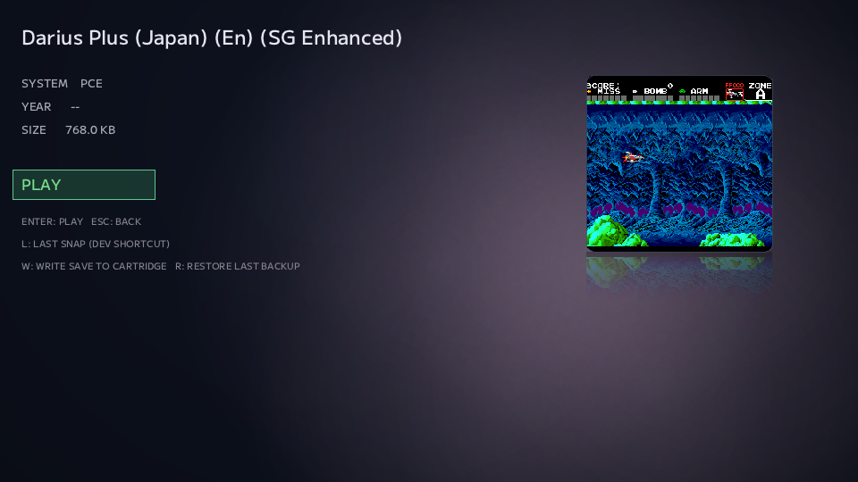

# #33 — 例外を、同じ形に押し込まない

前回、PC EngineのHuCardを読み始めて、standardな配置と384 KiBの少し変わった配置までNOA Systemへつなぎました。

その最後に、一つだけ残していた名前があります。

**ダライアスPLUS。**

このHuCardも物理read自体は安定していました。

Coreでも起動します。

でも、1 MiBのraw dataをそのまま照合してもtrusted Databaseには一致しません。

384 KiBのruleでもない。

standardなmirrorでもない。

だったら、似ているものへ無理に押し込まず、まずこの一本が何をしているのかを見ることにしました。

---

## 768 KiBまでは、きれいに一致する

実cartから得られた1 MiB rawを調べると、最初の768 KiBがtrusted Databaseのwhole-file exact hashと一致しました。

```text
raw[0x00000:0xC0000]
        ↓
768 KiB
        ↓
Trusted exact hash match
```

ここだけを見ると、

「では先頭768 KiBをcanonical ROMとして使えばよい」

と思いたくなります。

でもNOAでは、prefixが一致しただけでは切りません。

残りの256 KiBが何なのかを説明できなければ、Unknownなdataを勝手に捨てることになるからです。

---

## 末尾256 KiBだけが、直前のblockを映していた

rawの末尾を比較すると、こうなっていました。

```text
raw[0xC0000:0x100000]
==
raw[0x80000:0xC0000]
```

最後の256 KiBは、その直前の256 KiBと完全に同じです。

ところが、

```text
raw[0x40000:0x80000]
!=
raw[0x00000:0x40000]
```

です。

つまりraw全体が単純な周期mirrorになっているわけではありません。

```text
[ 256 KiB A ]
[ 256 KiB B ]
[ 256 KiB C ]
[ 256 KiB C ]  ← 最後だけlocal mirror
```

canonical imageは、

```text
A + B + C = 768 KiB
```

でした。

前回の384 KiB Intervalとも違う。

standardなfull mirrorとも違う。

**似ているけれど、別の物理layoutです。**

---

## 「タイトルがダライアスPLUSだから」では決めない

ここで大事なのは、このruleをゲーム名で適用していないことです。

```text
末尾tailが
candidate境界直前の同サイズblockとbyte-exactに一致
        ↓
768 KiB candidateを作る
        ↓
trusted whole-file exact hashを確認
        ↓
Knownとして採用
```

この順番です。

構造が成立しなければ、たとえ先頭768 KiBのhashが偶然一致してもtrimしません。

もちろん、

「ダライアスPLUSという名前だから768 KiB」

とも判断しません。

Unknown / Homebrewへ推測で同じruleを適用することもありません。

分からないrawは、そのまま残します。

---

## 例外は、共通化しないために分ける

PCEのcanonicalizationは、この時点で大きく三つの形になりました。

```text
standard linear / full mirror
384 KiB interval reconstruction
768 KiB + local tail mirror
```

一見すると、分岐が増えて面倒になったようにも見えます。

でも実際には逆でした。

違う構造を一つの「便利な汎用rule」へまとめると、どこかでUnknownなcartを誤って変換する危険が増えます。

だから、

**同じだと説明できるものだけを同じにする。**

違うものは、違うprofileとして分ける。

この方が実装は少し増えても、どこまで信頼してよいかが明確になります。

---

## 実物から、正式な768 KiBのゲームへ

実cart由来のraw dataでcanonicalizationを通すと、

```text
1 MiB physical raw
    ↓
local tail mirror evidence
    ↓
768 KiB candidate
    ↓
trusted exact hash
    ↓
KNOWN
```

まで成立しました。

自動testも既存のPCE pathを含めて44/44 PASS。

さらに実際のFrontendからLibrary → Game Detail → PLAYまで確認しました。

Game Detailには正式名称が表示され、

```text
SIZE 768.0 KB
```

になっています。

AutoSnap Previewにも、実際に動作しているゲーム画面が戻ってきました。



<sub>※ 掲載している画面はNOA Systemの開発・動作紹介を目的としたものです。画面内に表示されるゲーム映像・タイトル等の著作権および関連する権利は、それぞれの権利者に帰属します。</sub>

前回は「UnknownだったHuCardが、物理配置を理解すると正式名称へ戻ってくる」と書きました。

今回はその続きを、もう一本の例外で確かめた形です。

---

## 動作確認そのものも、道具になってきた

今回もう一つ便利だったのが、実機Acceptanceの記録です。

対応Systemや実cartが増えるほど、

- 何をDumpしたか
- rawは再現したか
- Databaseへ一致したか
- Coreで起動したか
- GUIからPLAYしたか
- 何がまだ未確認か

を人間の記憶だけで追うのは厳しくなります。

そこで最近は、Issueを進めながら確認結果を記録し、その情報から人間向けのcompatibility viewも追従させています。

開発のために作った一覧が、そのまま次の実機確認の道具になる。

こういう周辺の仕組みも、ハード対応が増えるほど効いてきました。

---

## 例外を消すのではなく、理解する

新しいハードへ対応していくと、どうしても例外が出てきます。

できれば共通化したい。

分岐は減らしたい。

それ自体は悪くありません。

でも、物理的に違うものまで「たぶん同じ」として扱う必要はありません。

NOA Systemで大事にしたいのは、例外を消すことではなく、

**なぜ違うのかを説明できるところまで理解すること。**

今回のダライアスPLUSは、小さな一例です。

でも、こういう一本ずつの理解が、最終的には「知らないカートリッジへ余計なことをしない」安全性につながっていきます。

---

## micから

手元にあるROMで検証できてなかったダライアスPLUS  
スッキリ動作確認OK

そして最近導入された動作確認リストが最高に便利で、issueで作業進めてるだけでEchoが勝手にリストも更新してくれる。  
更には人間が見やすい .md も更新される。  
なんて便利なんだ・・・

--- mic

---

← [前の日記 #32 — 三台目のハードが、NOAに加わった](0032-third-system-pce.md)

[次の日記 #34 — メニューを足したら、画面の寿命が見えた](0034-menu-revealed-lifetime-rule.md) →
