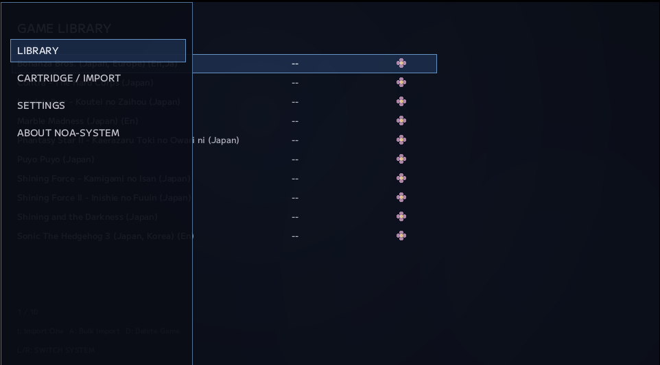

# #34 — メニューを足したら、画面の寿命が見えた

NOA Systemに機能が増えてくると、そろそろ「ゲームを選ぶ画面」だけでは足りなくなってきました。

Library。

Cartridge / Import。

Settings。

Game Environment。

About。

こうしたNOA本体側の機能へ入るための、トップレベルの入口が必要です。

そこで、画面左から出てくる小さな **NOA Menu** を作ることにしました。

最初は、それだけの話になるはずでした。

でも実際に触り始めると、入力の持ち越し、ESCの役割、Overlayの責務、そしてViewそのものの寿命まで見直すことになります。

今回は、メニューを一つ足したことでFrontendのルールが少し深くなった話です。

---

## 常に見えているメニューにはしない

最初に考えたのは、左側へ常設Sidebarを置く形でした。

でもNOAでは、Libraryをできるだけ広く使いたい。

PCのfile managerっぽさも、あまり強くしたくありません。

将来的にはcontroller中心のTV利用も考えたい。

そこで通常時は隠しておき、必要な時だけ左から出すslide-out menuにしました。

```text
Library / Game Detail
        ↓
SELECT / hamburger
        ↓
NOA Menu
  ├ Library
  ├ Cartridge / Import
  ├ Settings
  └ About NOA-System
```

controllerではSELECT。

mouseではhamburger。

keyboardでは開発中の操作も含めて呼び出せます。

画面を常時占有せず、それでも「NOA本体へ触る入口」は一か所にまとまりました。

---

## LibraryとSettingsは、同じ「場所」ではない

ここでもう一つ決めたことがあります。

LibraryやGame Detailは、ユーザーが実際に移動するPrimary Viewです。

一方でSettingsやGame Environmentは、「別の場所へ行く」というより、今いるFrontendの上でNOA本体を設定している感覚に近い。

なので同じnavigation stackへ全部積むのはやめました。

```text
Primary View
  Library
  Game Detail
  Cartridge / Import

System Utility
  Settings
  Game Environment
  About
```

System Utility側は独立したOverlayとして開きます。

閉じれば、そのまま元のLibraryやGame Detailへ戻る。

この分離のおかげで、後からGame Environmentのような管理画面が増えても、Library側のnavigationを必要以上に複雑にせずに済みます。

---

## 実際に触ると、入力は思ったより素直じゃない

最初の実装を実機で触ると、すぐに細かい違和感が出ました。

たとえばNOA Menuで `LIBRARY` を決定する。

Library rootへ戻る。

ところが決定に使ったbuttonがそのまま裏のLibraryへ伝わり、続けてGame Detailへ入ってしまう。

人間から見ると、

```text
LIBRARYを選んだ
        ↓
なぜかゲームまで開いた
```

です。

原因は、Overlayが閉じた直後に、同じ物理入力を背後のViewが「新しい入力」として拾っていたことでした。

そこでOverlayの入力抑止を解除するタイミングで、背後View側の入力状態も再同期するようにしました。

UIを重ねるだけなら簡単です。

でも**入力には押した瞬間だけでなく、押している途中・離す瞬間まで時間がある**。

このあたりは、実際にcontrollerで触らないとなかなか見えてきません。

---

## ESCは、一つのキーなのに役割が二つあった

さらに厄介だったのがESCです。

FrontendではESCをBackとして使いたい。

一方でgameplay中は、もともとESCでSession Exitする処理もありました。

InGameMenuを開いた状態でESCを押すと、

```text
polling側
  ESC = Back
  → Menuを閉じる

event側
  ESC = Session Exit
  → Gameを終了する
```

が同時に成立してしまいました。

つまり、一回ESCを押しただけなのに二つの経路が反応していたわけです。

Overlayが開いている時はSession Exitしない。

さらに、閉じるために使ったESCをまだ押しっぱなしにしている間も、key repeatでExitへ進まない。

既にSessionOverlayが持っていたrelease gateへ揃えることで、

```text
Menu open中のESC
→ Menuを閉じるだけ

閉じた直後のheld / repeat
→ 何もしない

一度releaseした後の新しいESC
→ 通常のSession Exit
```

という意味に整理しました。

---

## そして、本当にクラッシュした

ここまでは入力の話でした。

でもManual Acceptance中、もっと大きな問題が出ました。

InGameMenuから `EXIT GAME` を選ぶと、アプリが停止する。

最初はESC routingの延長に見えました。

そこでクラッシュdumpを追いました。

結果、原因は別でした。

SessionのViewは、Exit処理の途中でnavigation stackから自分自身をPopします。

つまり、

```text
view->Render()
    ↓
ExitSession()
    ↓
PopView()
    ↓
そのView自身が破棄される
```

ことがあります。

ところが呼び出し元のFrontendは、`Render()` が戻った後も、呼び出し前に取得していたraw pointerをそのまま使っていました。

そこへ今回追加したhamburger表示判定が入り、

```text
破棄済みView
    ↓
IsTopMenuBlocked()
```

を呼んでしまった。

use-after-freeです。

minidump上でも、解放済みView経由の仮想関数呼び出しと整合する形で落ちていました。

---

## Viewを呼んだ後、そのViewがまだいるとは限らない

修正自体は小さいものでした。

```cpp
view->Render(...);

// Render()の中でnavigation stackが変わったかもしれない
view = CurrentView();
```

もう一度、現在のViewを取り直す。

でもこの件から、Frontend全体で使えるルールが一つ増えました。

> **Navigation stackを変更し得るView callの後では、それ以前に取得したraw View pointerを再利用しない。**

`Tick()`。

`Render()`。

あるいはその先で `PushView()` / `PopView()` / `ReplaceCurrentView()` に到達し得る処理。

その後にViewへ触るなら、必ず `CurrentView()` を取り直す。

以前からCartridge Monitorの更新後には同じ対策がありました。

今回のクラッシュで、それが局所的な例外ではなく、Frontendのlifetime ruleとして明確になりました。

---

## 小さなUIから、少し大きな設計ルールへ

最終的には、

- SELECT / hamburgerでNOA Menuを開く
- SettingsやAboutはSystem Utility Overlayとして開く
- Enterで決定
- ESC / Backの役割を整理
- Overlay表示中は背後Viewへ入力を漏らさない
- Libraryへ戻った時の入力持ち越しを防ぐ
- Session中のESCを安全に処理する
- View lifetime ruleを明文化する

ところまでまとまりました。



最初の目的は、左からメニューを一枚出すことでした。

でもUIは、それだけでは独立して存在しません。

入力。

Navigation。

Viewの寿命。

Session。

全部とつながっています。

こういうところは、実装して、実際に触って、壊してみないと分かりません。

---

## 見た目より先に、意味を揃える

この時点では、NOA Menuの見た目を最終形まで磨いてはいません。

slideの速度を触ったり、名称を `ABOUT NOA-SYSTEM` へ直したり、Enterで決定できるようにしたり。

まだ小さな調整段階です。

それでも先に、

```text
Primary Viewとは何か
System Utilityとは何か
Backとは何か
Activateとは何か
Viewはいつまで生きているのか
```

を揃えられたのは大きかったと思います。

UIは最終的に見た目へ出ます。

でも、その下にある意味が揃っていないと、触るたびにどこかで齟齬が出る。

NOA Menuは、その意味を整理する最初の入口にもなりました。

---

← [前の日記 #33 — 例外を、同じ形に押し込まない](0033-dont-force-the-exception.md)
