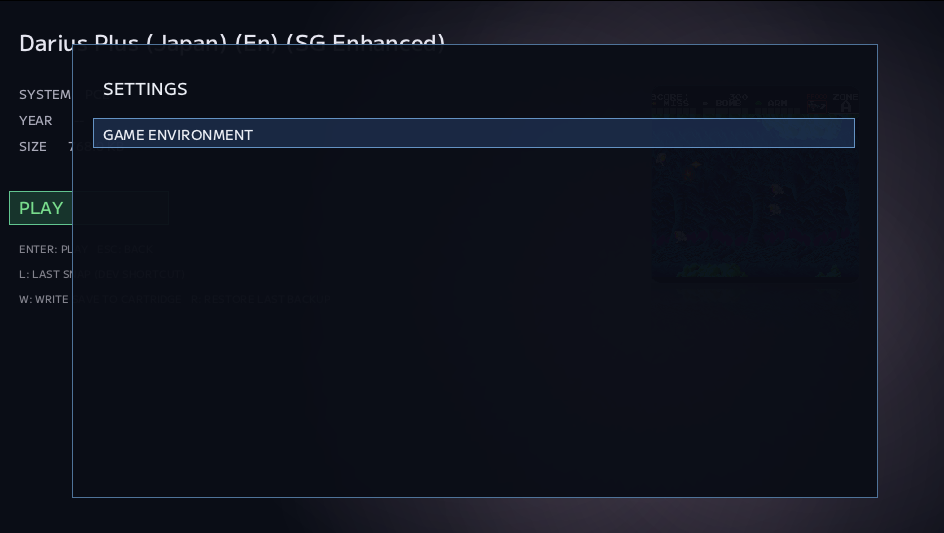

# #35 — Coreを管理する。でも、Coreを使わせない

NOA Systemで対応するハードが増えてくると、避けて通れないものがありました。

**ゲームを動かすCoreを、どう準備するか。**

開発中は、必要なCoreを手でdownloadして、決めた場所へ置けば動きます。

でもSystemが増えるたびにそれを繰り返すのは面倒です。

Coreが無い状態を試したい時にも、手で退避する必要がある。

別のPCへ持っていけば、また同じ準備が必要になる。

そこで、NOA自身が必要なゲーム環境を準備できるようにすることにしました。

ただし、ここで一つ大事にしたことがあります。

**Coreを管理できるようにすることと、ユーザーへCore管理をさせることは別です。**

---

## 最初は、一つのCoreだけ

最初のvertical sliceは、すでに実機Acceptanceまで済んでいたPC Engineを使いました。

やることは単純です。

~~~text
Catalog
  ↓
Download
  ↓
SHA-256 verify
  ↓
staging
  ↓
extract
  ↓
runtime file verify
  ↓
safe install
  ↓
installed metadata
~~~

途中で失敗しても、すでに入っているCoreを壊さない。

downloadやextractが失敗した段階では、既存環境へ触らない。

runtime fileを置き換える時もbackupを持つ。

installed metadataも、実体のinstallが成功してから更新する。

そしてVerifyでは、

~~~text
実file
installed metadata
現在のRecommended package
~~~

を分けて見るようにしました。

ファイルそのものが壊れているのか。

以前installしたpackageとしては正しいが、現在のRecommendedとは違うのか。

そもそも入っていないのか。

それぞれ意味が違います。

---

## SystemとCoreを、最初から1対1にしない

ここで早い段階に一度、設計を直しました。

Core packageの情報にSystemを直接持たせると、

~~~text
Mega Drive
Game Gear
Master System
SG-1000
~~~

のように、複数Systemが一つのCoreを共有する時に困ります。

そこで責務を分けました。

~~~text
System
  ↓
Selected CoreId
  ↓
Core Package
~~~

Systemは「どのCoreを使うか」を持つ。

Package Managerは「そのCoreがinstallされているか」を持つ。

Core package自身は、どのSystemから使われるかを知らなくていい。

この分離は後でかなり効いてきます。

---

## Backendを、Game Environmentへつなぐ

Package Managerだけができても、ユーザーは使えません。

前回作ったNOA Menu / Settings shellから、

~~~text
SETTINGS
  ↓
GAME ENVIRONMENT
~~~

へ入れるようにして、FrontendからSetup / Verify / Removeを試せるようにしました。

最初はCore Package Managerそのものを操作するような画面に近かったのですが、実際に触ると少し違和感がありました。

NOAで知りたいのは、

「Beetle PCE FastというCore packageを管理する」

ことではありません。

**PC Engineのゲーム環境がReadyかどうか**

です。

そこで画面を、

~~~text
GAME ENVIRONMENT
  ↓
System一覧
  ↓
Environment Detail
~~~

という形へ変えました。

Systemを選ぶ。

そのSystemが現在どのCoreを使っているかを見る。

必要ならSetupする。

Verifyする。

消したらNot Installedになる。

もう一度SetupすればReadyへ戻る。

実機でも、

~~~text
Ready
 ↓
Delete
 ↓
Not Installed
 ↓
PLAY不可
 ↓
Setup
 ↓
Ready
 ↓
PLAY成功
~~~

まで一周しました。

Backendのpackage操作が、初めて「ゲーム環境を整える」というユーザー操作になりました。

---

## でも、ここでもう一度やり直した

次に出てきたのが、

**SystemへどのCoreを割り当てるか**

という話です。

最初は、

~~~text
Unassign
Reassign Recommended
~~~

のような操作を考えていました。

でも相談を重ねるうちに、少しモデルが不自然だと分かってきました。

PackageをDeleteすることと、

SystemからCore assignmentを外すことは、

別の操作です。

例えばMega DriveとGame Gearが同じCore packageを使っている時、

そのpackageをDeleteしたからといって、

「Mega DriveはもうこのCoreを使わない」

という意味にはなりません。

単に、

~~~text
Selected Core: そのまま
Package State: Not Installed
~~~

になるだけです。

そこでUIもmodelも、

**Selected Core + Package State**

へ整理し直しました。

---

## DeleteとChange Coreを分ける

最終的なDetailでは、意味がかなり単純になりました。

~~~text
Selected Core
Status

Install / Reinstall
Verify
Delete
Change Core
~~~

Deleteはpackage実体を消すだけ。

Selected Coreは変わりません。

Change CoreはSystemが使うCoreIdを変えるだけ。

新しいCoreが未installなら、その場でNot Installedと分かる。

Noneを選べば、明示的にCoreを使わない状態にもできる。

そして複数Systemが同じCore packageを使う場合は、

~~~text
Used by:
- Mega Drive / Genesis
- Game Gear
- Master System
- SG-1000
~~~

のように、そのpackageの影響範囲を見せられる構造にしました。

この時点ではCore候補自体はまだ少なく、複数Coreを本格的に選ぶUIは将来です。

でも、その時に作り直さなくて済むように、

~~~text
System -> CoreId
CoreId -> Package
~~~

というidentityは先に固めました。

---

## filenameをidentityにしない

途中の実装では、Systemが使っているruntime filenameと、Core packageのexpected filenameを突き合わせて、

「これは同じCoreだろう」

と逆引きしていました。

一つしかない間は動きます。

でも、assignmentを正式な機能にするなら、それは少し危うい。

filenameはruntime上の属性であって、

SystemとCoreの関係そのものではありません。

そこで、

~~~text
PCE -> beetle_pce_fast
MD  -> genesis_plus_gx
~~~

のように、SystemからCoreIdを明示的に持つ形へ変更しました。

少し遠回りしましたが、

ここでidentityを整理したことで、

package共有、将来の複数Core、Delete、Change Coreの意味が全部同じmodelで説明できるようになりました。

---

## 「手動で入れるのが面倒」から始まった

この機能の出発点は、かなり単純でした。

Coreを手動でdownloadして配置するのが面倒。

それだけです。

でも結果として、

- Coreをrepoへ抱え込まずに済む
- 必要な時にSetupできる
- 欠落状態を簡単に再現できる
- Verify / Repairの入口になる
- 初回セットアップへつなげられる
- 複数Systemで共有するCoreを一つのpackageとして扱える
- Systemとpackageのlifetimeを分離できる

という、かなり大きな土台になりました。

途中ではupstreamのmutableな配布物が変わり、固定hashとの照合が止まる出来事もありました。

その時は安全に止まれた一方で、

「Recommended packageをどう再現可能にするか」

という別の課題も見えました。

この話は後で、Core revision管理をもう一度考え直すことになります。

---

## 使わせたいのは、Core Managerではない

NOA Systemはlibretro Coreを使っています。

だから内部では、CoreIdも、packageも、hashも、installed metadataも必要です。

でもユーザーがやりたいことは、

**エミュレータの部品を管理することではありません。**

ゲームを遊べる環境を整えることです。

だから内部では細かく分ける。

外では、意味をまとめる。

~~~text
内部:
System -> CoreId -> Package -> Runtime file

ユーザー:
このSystemは Ready
~~~

この二つを同じものにしない。

今回かなりドタバタしたのは、その境界を途中で何度も見直したからでした。

でも最終的には、最初よりずっと単純な形になりました。

複雑なものを隠すために、内部まで曖昧にするのではなく、

**内部をきちんと分けたから、外側をシンプルにできた。**

Game Environmentは、そんな画面になり始めています。

---

## micから

遂にゲームコアをそれぞれDL, Deleteする仕組みの準備ができた。
これがあるとハードを増やす度にコアを入れる手間も無くなるし、ない場合の動作も確認できる。
何よりNOA自体が色んなライセンスのOSSを保持しなくてもいいし、ユーザもセットアップだけ実行すればいい。いい落としどころだと思う。

次は NOA Menuと接続する所だ。

---

最初はコアを僕が手動でインストールするのが面倒。
っていう我儘からきてる Issue なんだけど、これを今回は機能として昇華した。

この機能はチェックにも便利だし、後々作る初回セットアップみたいな時に超役立つ。
問題は、この機能が今、僕ですらメニューの使い方がわからなかったので後でブラッシュアップする必要があるってことかな。

でもきっと次の次くらいには良くなってる。

---

ここの実装は結構ドタバタしてしまった。
最初の提案でいいかなって思ったけど、色々と悩んで相談した結果、結構大きめな仕様修正となりタコさんに色々と迷惑をかけちゃった。

でも、結果としてシンプルな実装になり、細かい調整も入れてもらってとてもいいものが出来たかな。

--- mic

---

← [前の日記 #34 — メニューを足したら、画面の寿命が見えた](0034-menu-revealed-lifetime-rule.md)
