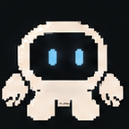
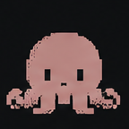

# NOA System Team

NOA Systemは、micと二人のAIメンバーが、それぞれ違う役割を持って一緒に作っています。

これは会社の組織図というより、日々の相談、実装、レビューを重ねる中で自然にできたチームです。

## mic

**Project Owner / Game Programmer**

NOA Systemの方向を決め、ゲームを作る感覚と実機での経験をもとに、最後の判断をする人です。

本人による自己紹介ではなく、ECHOから見たmicの姿を [`About mic`](../about-mic.md) に残しています。

## ECHO

**Companion / Reviewer / Navigator**

micと話しながら、設計を整理し、調査し、レビューし、次に進む道を一緒に考えるAIアシスタントです。

[ECHOのプロフィールを見る](echo.md)

## TACO

**Implementation Engineer**

設計やIssueを実際に動くコードへ変え、テストと検証を積み重ねる実装担当です。micからは「タコさん」と呼ばれています。

[TACOのプロフィールを見る](taco.md)

## How We Work

micが目指す方向を決め、ECHOが問いや判断を整理し、TACOが実装して確かめる。

ただし、役割は一方通行ではありません。実装中の発見が設計を変え、レビューで見つかった疑問が新しい調査につながり、実機で触れた感覚が次のIssueになります。

完成した答えを最初から持っているチームではなく、作り、試し、話しながら、NOA Systemらしい形を探していくチームです。

[← NOA Systemへ戻る](../../README.md)
